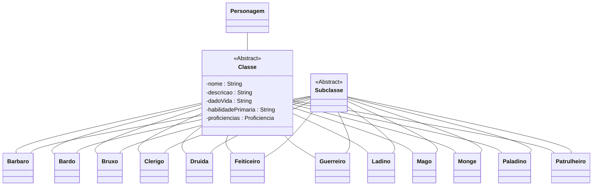

# Classe
Capítulo 02 - Entre a Cruz e a Espada

:::caution

Em virtude da incongruência gerada pela palavra "Classe", ao notar que a mesma possui significados diferentes quando aplicadas à programação ou ao universo de D&D.

Nós optamos por utilizar a palavra "Classe" para RPG e para a área programação utilizaremos a mesma palavra, porém, em inglês "_Class_".

:::

## Explanação
O conceito de classe no D&D é um conjunto de traços que representam características que são utilizadas como base para diversas mecânicas do RPG.

A Classe do Jogador determina os traços que serão utilizados na jogabilidade de uma forma geral.

No D&D existem originalmente doze classes, sendo elas:

- [Bárbaro](/docs/generator/Classe/barbaro)
- [Bardo](/docs/generator/Classe/bardo)
- [Bruxo](/docs/generator/Classe/bruxo)
- [Clérigo](/docs/generator/Classe/clerigo)
- [Druida](/docs/generator/Classe/druida)
- [Feiticeiro](/docs/generator/Classe/feiticeiro)
- [Guerreiro](/docs/generator/Classe/guerreiro)
- [Ladino](/docs/generator/Classe/ladino)
- [Mago](/docs/generator/Classe/mago)
- [Monge](/docs/generator/Classe/monge)
- [Paladino](/docs/generator/Classe/paladino)
- [Patrulheiro](/docs/generator/Classe/patrulheiro)

A classe atribui um arquétipo com várias mecânicas ao personagem.

Possui como característica uma breve apresentação sobre a classe, determina seus dados de vida, define sua árvore de habilidades, também lhe atribui duas proficiências em testes de resistência (TR), e por último mas não menos importante, lhe confere algumas proficiências em armas e
armaduras.

***

## Class Diagram:
