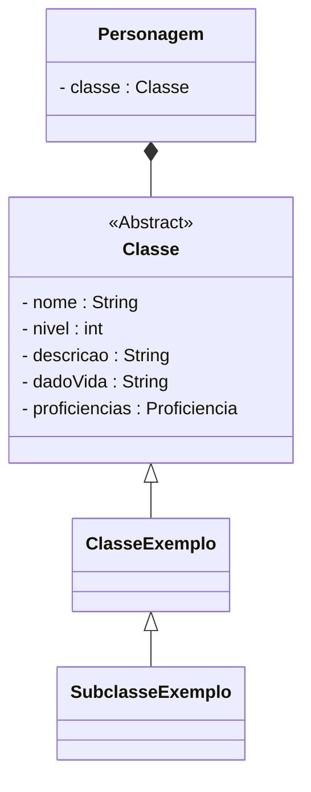

# Classes
Capítulo 02 - Entre a Cruz e a Espada

:::caution
"Em virtude da incongruência gerada pela palavra "Classe", ao notar que a mesma possui significados diferentes quando aplicadas à programação ou ao universo de D&D.

Nós optamos por utilizar a palavra "Classe" para RPG e para a área programação utilizaremos "Vocação".
:::

## Para o D&D
:::note
"A classe é a definição principal de o quê um personagem pode fazer. É mais do que uma profissão: é a vocação de um personagem. As classes modificam a forma de um personagem perceber e interagir com o mundo, bem como seu relacionamento com as outras pessoas e poderes do multiverso." (PHB, pg.19)
:::

No D&D existem originalmente doze classes, sendo elas:

- [Bárbaro](/docs/generator/Classe/barbaro)
- [Bardo](/docs/generator/Classe/bardo)
- [Bruxo](/docs/generator/Classe/bruxo)
- [Clérigo](/docs/generator/Classe/clerigo)
- [Druida](/docs/generator/Classe/druida)
- [Feiticeiro](/docs/generator/Classe/feiticeiro)
- [Guerreiro](/docs/generator/Classe/guerreiro)
- [Ladino](/docs/generator/Classe/ladino)
- [Mago](/docs/generator/Classe/mago)
- [Monge](/docs/generator/Classe/monge)
- [Paladino](/docs/generator/Classe/paladino)
- [Patrulheiro](/docs/generator/Classe/patrulheiro)

## Para a programação
Optamos por definir a Vocação, como uma Classe Abstrata que será especializada por uma classe, seja ela um [Guerreiro](/docs/generator/Classe/guerreiro), [Mago](/docs/generator/Classe/mago), ou qualquer uma das dez classes restantes.

## Diagrama de Classe

## Código Dart
    import 'habilidade.dart';

    abstract class Classe {
      String _nome = "";
      String _descricao = "";
      int _dadoVida = 0;
      String _habilidadePrimaria = "";
      String _proficienciaArmasArmaduras = "";
    List<Habilidade> _habilidades = [];

    String get nome => _nome;
    set nome(String nome) => _nome = nome;

    String get descricao => this._descricao;
    set descricao(String descricao) => this._descricao = descricao;

    int get dadoVida => this._dadoVida;
    set dadoVida(int value) => this._dadoVida = value;

    String get habilidadePrimaria => this._habilidadePrimaria;
    set habilidadePrimaria(String value) => this._habilidadePrimaria = value;

    String get proficienciaArmasArmaduras => this._proficienciaArmasArmaduras;
    set proficienciaArmasArmaduras(String value) =>
        this._proficienciaArmasArmaduras = value;

    List<Habilidade> get habilidades => this._habilidades;
    addHabilidade(habilidade) => this._habilidades.add(habilidade);
    }