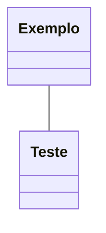

# Anão da Montanha
Um anão da montanha é forte e resistente, acostumados a uma vida difícil em terrenos difíceis. Descendente daqueles mais altos dentre os anões, tendem a possuir uma coloração mais clara.

    "Os anões do escudo do norte de Faerûn, bem como o clã governante Hylar e os clãs nobres Daewar de Dragonlance, são anões da montanha." (PHB, p.20)

## Traços Raciais dos Anões da Montanha
### Aumento no Valor de Habilidade
Seu valor de **Força aumenta em 2**.

### Treinamento Anão com Armaduras
Você adquire **proficiência em**:
- **Armaduras Leves**
- **Armaduras Médias**

## Class Diagram
