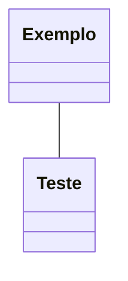

# Anões
Baixinhos e robustos com uma memória gigante que só não supera seu rancor

    "Com astucia e muita resistência, os anões são conhecidos como hábeis guerreiros, mineradores e trabalhadores em pedra e metal. Embora tenham menos de 1,50 metro de altura, os anões são tão largos e compactos que podem pesar tanto quanto um humano 60 centímetros mais alto. Sua coragem e resistência compete facilmente com qualquer povo mais alto. A pele dos anões varia do marrom escuro a um matiz mais pálido, tingido de vermelho, mas os tons mais comuns são o castanho claro ou bronzeado, como certos tons terrosos. O cabelo é longo, mas de estilo simples, geralmente negro, cinzento ou castanho, embora anões mais pálidos frequentemente possuem cabelos ruivos." (PHB, p.18)

## Traços Raciais dos Anões
Um personagem anão possui uma variedade de habilidades inatas, parte integrante da natureza dos anões.

### Aumento no Valor de Habilidade
Seu valor de **Constituição aumenta em 2**.

### Idade
Anões tornam-se maduros na mesma proporção que os humanos, mas são considerados jovens até atingirem a idade de 50 anos. Em média, eles vivem 350 anos.

### Tendência
A maioria dos anões é **leal**, pois acreditam firmemente nos benefícios de uma sociedade bem organizada. Eles **tendem para o bem**, com um forte senso de honestidade e uma crença de que todos merecem compartilhar os benefícios de uma ordem social justa.

### Tamanho
Anões estão entre 1,20 e 1,50 metro de altura e pesam cerca de 75 kg.
**Seu tamanho é Médio.**

### Deslocamento

Seu **deslocamento base de caminhada é de 7,5 metros**. Seu deslocamento não é reduzido quando estiver usando armadura pesada.

### Visão no Escuro

Acostumado à vida subterrânea, você tem uma visão superior no escuro e na penumbra. **Você enxerga na penumbra a até 18 metros como se fosse luz plena**, e no escuro como se fosse na penumbra. Você não pode discernir cores no escuro, apenas tons de cinza.

### Resiliência Anã
Você possui **vantagem em testes de resistência contra venenos** e **resistência contra dano de veneno**.

### Treinamento Anão em Combate
Você tem **proficiência com**:
- **Machados de batalha**
- **Machadinhas**
- **Martelos leves**
- **Martelos de guerra**

### Proficiência com Ferramentas
Você tem **proficiência em uma ferramenta** de artesão **à sua escolha entre**:
- **Ferramentas de ferreiro**
- **Suprimentos de cervejeiro**
- **Ferramentas de pedreiro**

### Especialização em Rochas
Sempre que você realizar um teste de Inteligência (História) relacionado à origem de um trabalho em pedra, **você é considerado proficiente na perícia História e adiciona o dobro do seu bônus de proficiência ao teste**, ao invés do seu bônus de proficiência normal.

### Idiomas
Você **pode falar, ler e escrever**:
- **Comum**
- **Anão**

O idioma Anão é repleto de consoantes duras e sons guturais, e essa característica influencia, como um sotaque, qualquer outro idioma que o anão falar.

### Sub-raça
Existem duas sub-raças principais de anões nos mundos de D&D, **você deve escolher uma dessas sub-raças**:

- **Anões da colina**
- **Anões da montanha**

## Class Diagram
