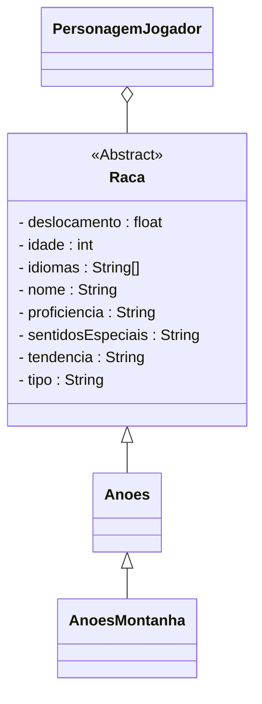

# Raça
Capítulo 03 - "Wait, who are you?"

## Explanação
Cada personagem pertence a uma raça, uma das muitas espécies humanoides inteligentes do mundo de D&D.

Existem raças comuns como:
- [Anões](/docs/generator/Raca/Anoes)
- [Elfos](/docs/generator/Raca/Elfos)
- [Halflings](/docs/generator/Raca/Halflings)
- [Humanos](/docs/generator/Raca/Humanos)

E algumas raças menos difundidas como:
- [Draconatos](/docs/generator/Raca/Draconatos)
- [Gnomos](/docs/generator/Raca/Gnomos)
- [Meio-elfos](/docs/generator/Raca/MeioElfos)
- [Meio-orcs](/docs/generator/Raca/MeioOrcs)
- [Tieflings](/docs/generator/Raca/Tieflings)

Algumas raças também têm sub-raças, como o [Anão da Montanha](/docs/generator/Raca/Anoes/anaoDaMontanha) ou o [Elfo da Floresta](/docs/generator/Raca/Elfos/elfoDaFloresta).

A raça que você escolher contribui para a identidade de seu personagem de uma forma importante, estabelecendo sua aparência geral e os talentos naturais obtidos a partir de sua cultura e de seus antepassados.

A raça de um personagem garante certos traços raciais, tais como:

- Sentidos especiais
- Proficiência com:
    - Armas
    - Ferramentas
    - Perícias
- Capacidade de usar magias menores ~~em alguns casos~~

:::info
Alguns desses traços podem se encaixam com certas classes, fazer isso pode criar combinações bem divertidas, então lembre-se de lê-los com muita atenção!
:::

***

## Class Diagram:
