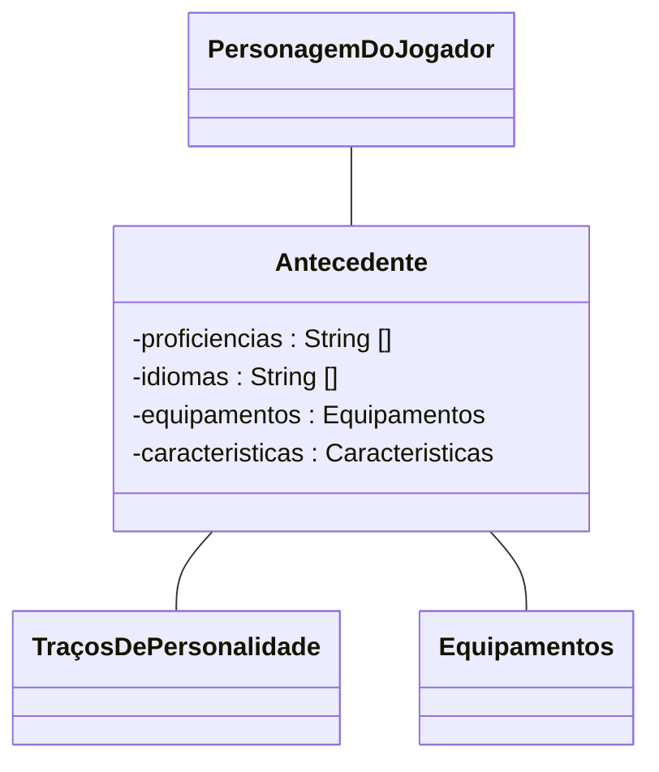

# Antecedente
Capítulo 04 - De Volta ao Início

## Explanação
O conceito de antecedente é utilizado para estabelecer mesmo que de forma simples o que o personagem de um jogador fazia antes de se tornar um aventureiro.

O Antecedente agrega para um personagem algumas proficiências, idiomas conhecidos, equipamentos iniciais e algumas sugestões de características, são elas: traço de personalidade, ideal, vínculo e defeito.

***

## Class Diagram:
