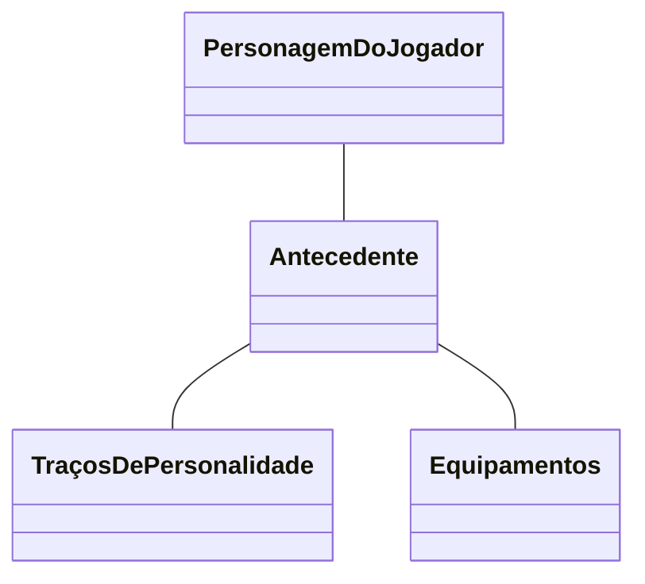

# Antecedente
Capítulo 04 - De Volta ao Início

## Explanação
Personagens são definidos por suas próprias histórias, interesses, conexões e capacidades que vão além do que sua raça ou classe podem definir. O antecedente define detalhes de sua personalidade e tendência.

:::note
"O nome do seu personagem e a descrição física podem ser as primeiras coisas que os outros jogadores na mesa aprenderão sobre você. É melhor pensar como essas características refletem o personagem que você tem em mente. (PHB, pg.123)"
:::

## Tendência
Esses breves resumos das nove tendências descrevem o comportamento típico de uma criatura que a possua. Os indivíduos podem variar significantemente desse comportamento típico e poucas pessoas são perfeitas e consistentemente fiéis aos preceitos básicos de sua tendência.

### Leal e Bom (LB)
É a tendência de criaturas que se pode contar para fazer o que é correto como é esperado pela sociedade. Dragões dourados, paladinos e muitos anões são leais e bons.

### Neutro e Bom (NB)
É a tendência do povo que faz o melhor que pode para ajudar outros de acordo com suas necessidades. Muitos celestiais, alguns gigantes das nuvens, e grande parte dos gnomos são neutros e bons.

### Caótico e Bom (CB)
É a tendência de criaturas que agem de acordo com sua própria consciência, se importando pouco com as expectativas dos outros.
Dragões de cobre, muitos elfos e unicórnios são caóticos e bons.

### Leal e Neutro (LN)
É a tendência dos indivíduos que agem de acordo com as leis, tradições ou códigos pessoais.
Muitos monges e alguns magos são leais e neutros.

### Neutro (N)
É a tendência daqueles que preferem manter distância de questões morais e não tomar partido, fazendo o que aparenta ser melhor conforme a situação.
O povo lagarto, muitos druidas e diversos humanos são neutros.

### Caótico e Neutro (CN)
É a tendência das criaturas que seguem seus caprichos, mantendo sua liberdade
pessoal acima de tudo. Muitos bárbaros e ladinos, e alguns bardos, são caóticos e neutros.

### Leal e Mau (LM)
É a tendência das criaturas que conseguem metodicamente tudo o que querem, dentro dos limites de uma tradição, lei ou ordem. Diabos, dragões azuis e hobgoblins são leais e maus.

### Neutro e Mau (NM)
É a tendência daqueles que farão tudo o que quiserem, sem compaixão ou remorso. Muitos drow, alguns gigantes das nuvens e yugoloths são neutros
e maus.

### Caótico e Mau (CM)
É a tendência de criaturas que agem com violência arbitrária, estimulada por sua ganância, ódio ou sede de sangue. Demônios, dragões vermelhos e orcs são caóticos e maus.

***

## Class Diagram:
