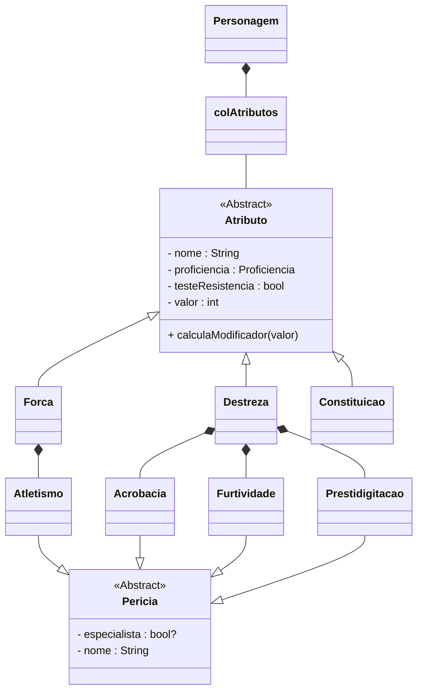

# Valores de Habilidade

## Para o Dungeons & Dragons
Seis Valores de Habilidades fornecem uma breve descrição das características físicas e mentais de cada criatura:
- **Força** mede o poder físico.
- **Destreza** mede a agilidade.
- **Constituição** mede a resistência.
- **Inteligência** mede o raciocínio e a memória.
- **Sabedoria** mede a percepção e a intuição.
- **Carisma** mede a força da personalidade.

:::note
"Um valor entre 10 e 11 é a média de um humano normal, mas os aventureiros e muitos monstros estão acima da média na maioria de suas habilidades. Um valor de 18 é o mais alto que uma pessoa normalmente atinge. Aventureiros podem ter valores tão altas quanto 20 e monstros ou seres divinos podem ter valores tão altas quanto 30."
:::

    Cada Valor de Habilidade também possui um modificador, derivado de seu valor de atributo.
    Podendo ser calculado utilizando a fórmula:
        (valorAtributo - 10)/2

### Pericias
Cada Valor de Habilidade abrange uma ampla gama de capacidades, incluindo as perícias que um personagem ou monstro pode ser proficiente. Uma perícia representa um aspecto específico de uma habilidade e a proficiência de um indivíduo em uma perícia demonstra um foco sobre esse aspecto.
As Proficiências são:
- Força
    - Atletismo
- Destreza
    - Acrobacia
    - Prestidigitação
    - Furtividade
- Constituição
    - Não possui
- Inteligência
    -
    -
    -
    -
    -
    -
- Sabedoria

- Carisma

## Para a Programação

### Diagrama de Classe

## Código Dart