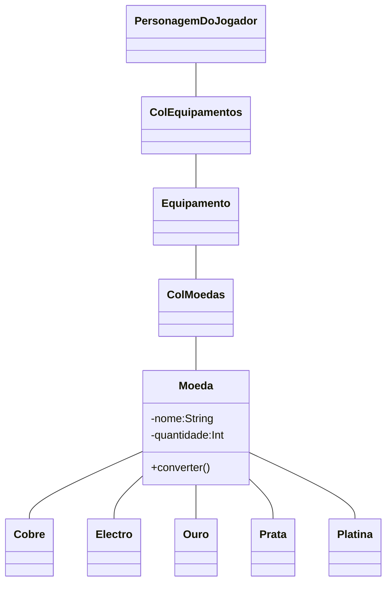

# Moeda
Capítulo 23 - Money, money, money

## Explanação
O sistema monetário de D&D possui 5 tipos de moedas, cada uma por sua vez tem um valor diferente, como pode ser observado na tabela a baixo:

| Moeda        | PC    | PP   | PE   | PO    | PL      |
|--------------|-------|------|------|-------|---------|
| Cobre (PC)   | 1     | 1/10 | 1/50 | 1/100 | 1/1.000 |
| Prata (PP)   | 10    | 1    | 1/5  | 1/10  | 1/100   |
| Electro (PE) | 50    | 5    | 1    | 1/2   | 1/20    |
| Ouro (PO)    | 100   | 10   | 2    | 1     | 1/10    |
| Platina (PL) | 1.000 | 100  | 20   | 10    | 1       |

***

## Class Diagram:
