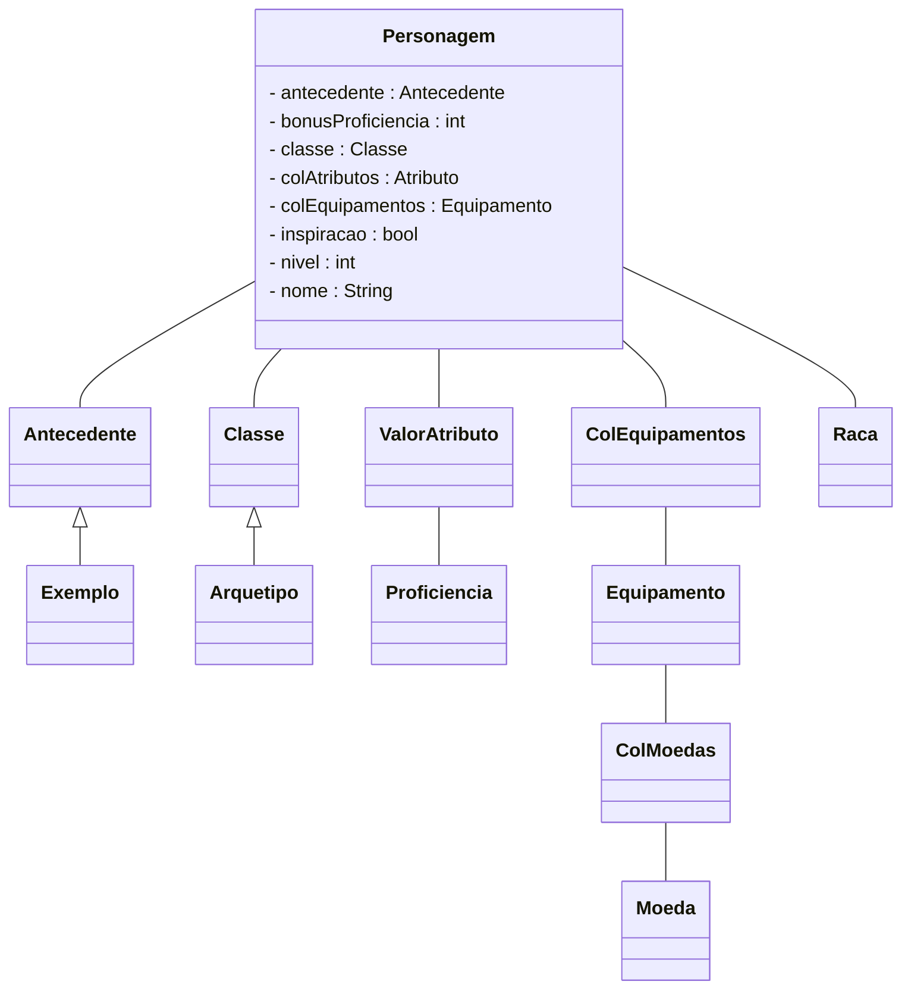

# Personagem
Capítulo 01 - O Espelho do Ego

## Explanação
A primeira etapa para jogar uma aventura em qualquer RPG é imaginar e criar um personagem.

:::note
"O personagem é uma combinação de estatísticas de jogo, ganchos de interpretação e imaginação." (PHB p.11)
:::

Nesse processo temos uma série de coisas para fazer, como escolher:
- [Antecedente](/docs/generator/antecedente)
- Aparência
- [Classe](/docs/generator/classe)
- [Raça](/docs/generator/raca)
- Traços de Personalidade

Depois de concluído, o personagem serve como seu representante no jogo, seu avatar no mundo de D&D.

***

## Class Diagram:
