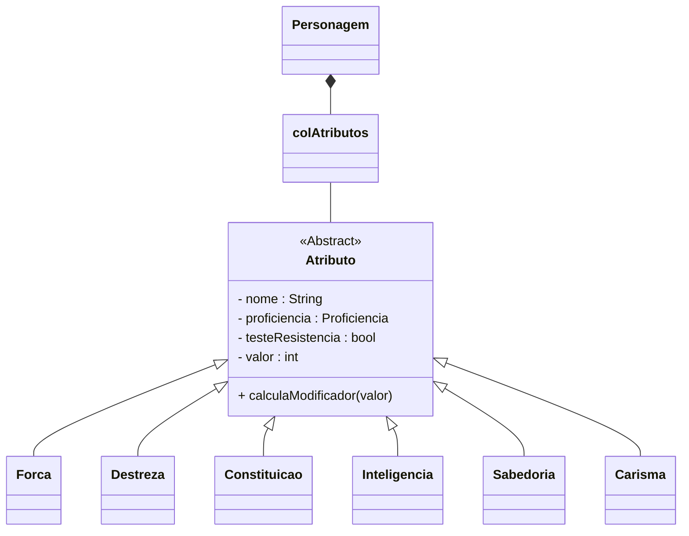

# Atributos
Seis habilidades fornecem uma breve descrição das características físicas e mentais de cada criatura:
- **Força** mede o poder físico.
- **Destreza** mede a agilidade.
- **Constituição** mede a resistência.
- **Inteligência** mede o raciocínio e a memória.
- **Sabedoria** mede a percepção e a intuição.
- **Carisma** mede a força da personalidade.

:::note
"Um valor entre 10 e 11 é a média de um humano normal, mas os aventureiros e muitos monstros estão acima da média na maioria de suas habilidades. Um valor de 18 é o mais alto que uma pessoa normalmente atinge. Aventureiros podem ter valores tão altas quanto 20 e monstros ou seres divinos podem ter valores tão altas quanto 30."
:::

    Cada habilidade também possui um modificador, derivado de seu valor de atributo.
    Podendo ser calculado utilizando a fórmula:
        (valorAtributo - 10)/2

## Diagrama de Classe

## Código Dart